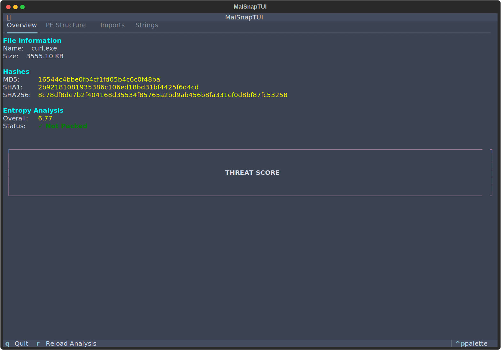

# MalSnap

**Fast, automated static analysis for Windows PE malware**

MalSnap is a Python-based static malware analysis tool designed for rapid triage and threat assessment of suspicious binaries. Built for security researchers, incident responders, and malware analysts.

## Features

- **Interactive File Browser**: Built-in filesystem navigator to select files for analysis
- **PE Structure Analysis**: Parse and analyze Windows portable executable files
- **Hash Generation**: MD5, SHA1, SHA256 for threat intelligence correlation
- **Entropy Analysis**: Detect packed/encrypted malware using Shannon entropy
- **String Extraction**: Intelligent filtering for URLs, IPs, registry keys, and suspicious strings
- **Import Analysis**: Identify suspicious Windows API calls commonly used by malware
- **YARA Integration**: Scan files against custom YARA rules
- **Threat Scoring**: Automated risk assessment (0-100 scale)
- **Multiple File Comparison**: Analyze and compare multiple files without restarting
- **Multiple Output Formats**: JSON for automation, text for human analysis
- **Professional ASCII Art Banner**: Distinctive branding in the terminal interface

## Installation

```bash
git clone https://github.com/devzephyr/MalSnap.git
cd MalSnap
pip install -r requirements.txt
```

### Requirements

- Python 3.7+
- pefile
- yara-python
- textual (for interactive TUI)

## Usage

### Quick Start (Interactive TUI - Default)

MalSnap defaults to a fully interactive terminal interface built with Textual, featuring an ASCII art banner, file browser, keyboard navigation, real-time analysis, and tabbed views.

**File Browser Mode (Recommended):**
```bash
python malsnap.py
```

Navigate through your filesystem with arrow keys, press Enter to analyze any file. Perfect for comparing multiple samples without restarting.

**Direct Analysis Mode:**
```bash
python malsnap.py suspicious.exe
```

Skip the browser and jump straight to analysis of a specific file.



The interactive TUI includes:
- **ASCII Art Banner**: Professional MALSNAP branding displayed on every screen
- **File Browser**: Navigate directories and select files with arrow keys and Enter
- **Tabbed Navigation**: Switch between Overview, PE Structure, Imports, and Strings tabs
- **Keyboard Controls**:
  - `q` - Quit from anywhere
  - `b` - Return to file browser (compare multiple files)
  - `Tab` - Switch between analysis tabs
  - Arrow keys - Navigate through content
- **Real-time Progress**: Live progress bar during analysis
- **Color-coded Results**: Visual indicators for threat levels and suspicious content
- **Scrollable Views**: Navigate through large datasets easily
- **Multiple File Comparison**: Analyze different files in one session for side-by-side comparison

### With YARA Rules

```bash
python malsnap.py suspicious.exe --yara rules/malware.yar
```

### For Automation (Text/JSON)

When you need machine-readable output for scripts or automation:

```bash
# Plain text output
python malsnap.py suspicious.exe --format text

# JSON output for automation
python malsnap.py suspicious.exe --format json --output report.json
```

## Output

MalSnap provides comprehensive analysis including:

### File Information
- File name, path, and size
- MD5, SHA1, SHA256 hashes

### PE Analysis
- File type (EXE, DLL, Driver)
- Compilation timestamp
- Target architecture
- Section analysis with entropy scores

### Entropy Analysis
- Overall file entropy
- Per-section entropy
- Packing detection (entropy > 7.0)

### String Extraction
- ASCII and Unicode strings
- Filtered interesting strings:
  - URLs and IP addresses
  - File paths and registry keys
  - Credential-related strings
  - Shell commands

### Import Analysis
- Imported DLLs and functions
- Suspicious API detection:
  - Process injection (VirtualAllocEx, WriteProcessMemory)
  - Anti-debugging (IsDebuggerPresent)
  - Keylogging (SetWindowsHookEx, GetAsyncKeyState)
  - Network activity (URLDownloadToFile, InternetOpen)
  - Encryption (CryptEncrypt, CryptDecrypt)

### Threat Score
Automated risk assessment based on:
- Packing/encryption indicators
- Suspicious API usage
- YARA rule matches
- Interesting strings

**Scoring:**
- 0-29: LOW RISK
- 30-59: MEDIUM RISK
- 60-100: HIGH RISK

## Example Output

### Interactive TUI Mode (Default)

When you run `python malsnap.py sample.exe`, you'll see an interactive terminal interface with:

**During Analysis:**
- Real-time progress bar showing current analysis stage (0-100%)
- Status indicator showing which file is being analyzed

**After Analysis - Tabbed Interface:**

**Tab 1: Overview**
- **File Information Panel**: File name, size, MD5/SHA1/SHA256 hashes (color-highlighted)
- **Entropy Analysis Panel**: Shannon entropy score with visual status indicator
  - ✓ Not Packed (green) - entropy < 7.0
  - ⚠ LIKELY PACKED/ENCRYPTED (red) - entropy > 7.0
- **Threat Score Widget**: Large, centered display with:
  - Numeric score (0-100) with color coding
  - Visual bar graph (█ filled, ░ empty)
  - Risk assessment (LOW/MEDIUM/HIGH)

**Tab 2: PE Structure**
- **Sections Table**: Interactive table showing all PE sections
  - Section name, virtual address, virtual size
  - Entropy per section
  - Suspicious indicators (⚠ for high entropy sections)
  - Scrollable for binaries with many sections

**Tab 3: Imports**
- **Suspicious API Calls List**: Red-highlighted dangerous Windows APIs
  - VirtualAllocEx - Remote memory allocation (process injection)
  - WriteProcessMemory - Write to another process (injection)
  - CreateRemoteThread - Remote thread creation (injection)
  - IsDebuggerPresent - Anti-debugging
  - CryptEncrypt/Decrypt - Encryption (possible ransomware)
  - Shows up to 20 most suspicious APIs
  - Empty state: "No suspicious API calls detected" (green)

**Tab 4: Strings**
- **Interesting Strings List**: Yellow-highlighted extracted strings
  - URLs, IP addresses, file paths
  - Registry keys, commands, credentials
  - Shows up to 30 strings with "...and X more" indicator
  - Scrollable for long lists

**Keyboard Controls:**
- `q` - Quit application (works from any screen)
- `b` - Browse files (return to file browser to analyze another sample)
- `Tab` - Switch between analysis tabs
- `Enter` - Select file in browser or expand directory
- Arrow keys - Navigate through file browser and content

### Comparing Multiple Files

Analyze and compare multiple samples in a single session:

1. Start MalSnap: `python malsnap.py`
2. Navigate to first sample (e.g., `wannacry.exe`) and press `Enter`
3. Review threat score and suspicious APIs
4. Press `b` to return to file browser
5. Navigate to second sample (e.g., `legitimate.exe`) and press `Enter`
6. Compare threat scores and characteristics
7. Repeat for as many files as needed - no restart required!

**Use Case Example:**
```bash
python malsnap.py
# Analyze WannaCry: Threat Score 95/100, HIGH RISK
# Press 'b', navigate to curl.exe
# Analyze curl.exe: Threat Score 30/100, MEDIUM RISK
# Immediate comparison without leaving the tool
```

### Text/JSON Mode

For automation or when saving to file:
```bash
# Plain text output
python malsnap.py sample.exe --format text

# JSON output
python malsnap.py sample.exe --format json --output report.json
```

## YARA Rules

Place YARA rules in the `rules/` directory. Example rule:

```yara
rule Suspicious_Packer
{
    meta:
        description = "Detects high entropy sections indicating packing"
        author = "MalSnap"

    strings:
        $upx = "UPX"
        $mpress = "MPRESS"

    condition:
        any of them
}
```

## Use Cases

### Malware Triage
Quickly assess unknown binaries for suspicious characteristics before deeper analysis.

### Incident Response
Generate hashes and identify malicious APIs during incident investigation.

### Threat Intelligence
Extract IOCs (hashes, IPs, URLs) for threat intelligence feeds.

### Academic Research
Study malware behavior patterns and common evasion techniques.

## Technical Details

### Entropy Calculation
Shannon entropy is calculated for the entire file and each PE section. High entropy (> 7.0) indicates packing or encryption, common malware obfuscation techniques.

### Suspicious API Detection
MalSnap maintains a curated list of 20+ Windows APIs commonly abused by malware:
- Memory manipulation (injection)
- Anti-analysis techniques
- Keylogging capabilities
- Network communication
- Registry persistence
- Encryption operations

### String Filtering
Regex-based filtering extracts potentially malicious indicators:
- Network artifacts (URLs, IPs, domains)
- File system paths
- Credential-related strings
- Shell commands
- Registry modifications

### TUI Architecture (Textual Framework)

MalSnap uses the Textual framework for building the terminal user interface. Key architectural decisions:

**Screen Management:**
- Implemented using Textual's `Screen` class with proper lifecycle management
- Two main screens: `BrowserScreen` (file navigation) and `AnalysisScreen` (results)
- Uses `switch_screen()` instead of `push_screen()` to prevent stack buildup
- This allows infinite file comparisons without memory leaks

**Key Challenges Solved:**

1. **Dynamic Screen Switching Issue**
   - Initial implementation used `recompose()` which doesn't properly handle widget lifecycle
   - Solution: Created separate `Screen` classes that each manage their own widget tree
   - Reference: [Textual Screens Guide](https://textual.textualize.io/guide/screens/)

2. **Widget Lifecycle Race Conditions**
   - Problem: Attempting to access ProgressBar before UI finished rebuilding
   - Solution: Use `switch_screen()` which properly handles mounting/unmounting
   - Workers now wait for `on_mount()` callback before accessing widgets

3. **Global Quit Binding**
   - Problem: 'q' only worked on specific screens
   - Solution: Moved `BINDINGS` to App level so quit works from any screen
   - Reference: [Textual App Bindings](https://textual.textualize.io/api/app/)

4. **DirectoryTree Event Handling**
   - DirectoryTree automatically emits `FileSelected` events on Enter key
   - Event handler uses `switch_screen()` to transition to analysis
   - No manual event posting required - Textual handles this natively

**Design Pattern:**
```python
# App manages screen transitions
class MalSnapTUI(App):
    BINDINGS = [("q", "quit", "Quit")]  # Global binding

# Screens handle their own lifecycle
class BrowserScreen(Screen):
    def on_directory_tree_file_selected(self):
        self.app.switch_screen(AnalysisScreen(...))

class AnalysisScreen(Screen):
    def on_mount(self):
        self.run_worker(self.analyze_file())
```

This architecture ensures clean separation of concerns and proper resource management.

### Development Journey

**Initial Challenge:** Creating a production-ready TUI that could handle dynamic content switching

**Evolution:**
1. **Phase 1: Rich-based TUI** - Started with Rich library for formatted output
   - Pros: Simple, beautiful output
   - Cons: Not interactive, no dynamic screen switching

2. **Phase 2: Textual with `recompose()`** - Attempted dynamic UI rebuilding
   - Problem: `recompose()` doesn't guarantee proper widget lifecycle
   - Result: ProgressBar not found errors, widgets accessing before mount

3. **Phase 3: Proper Screen Architecture** - Final implementation
   - Solution: Separate `Screen` classes for each view
   - Used `switch_screen()` for transitions (replaces screen, doesn't stack)
   - Global bindings at App level for consistent UX

**Key Learnings:**
- Textual's `Screen` class is the correct abstraction for different views
- `switch_screen()` > `push_screen()` for main workflow navigation
- `push_screen()` reserved for modals/dialogs that preserve context
- Widget access must happen after `on_mount()` completes
- Event handlers should use `event.stop()` to prevent duplicate processing

**ASCII Art Implementation:**
- Custom MALSNAP banner created using block characters (█ ╗ ╔ ║ ═)
- Displayed on both BrowserScreen and AnalysisScreen for branding consistency
- Uses Textual's Static widget with multiline string support

## Limitations

- **Static analysis only**: Does not execute samples (safe for analysis)
- **PE files only**: Currently supports Windows executables/DLLs
- **Signature-based detection**: May miss novel/polymorphic malware
- **No unpacking**: Packed samples require manual unpacking first

## Development Roadmap

- [ ] Support for ELF and Mach-O binaries
- [ ] Automated unpacking for common packers
- [ ] VirusTotal API integration
- [ ] Machine learning-based classification
- [ ] Web interface for batch analysis
- [ ] Docker container for isolated analysis

## Security Notice

This tool is designed for malware analysis. Always analyze samples in isolated environments:
- Air-gapped virtual machines
- Sandboxed containers
- Dedicated analysis workstations

Never execute untrusted binaries on production systems.

## Contributing

Contributions welcome! Areas for improvement:
- Additional suspicious API patterns
- More YARA rules
- ELF/Mach-O support
- Performance optimizations

## License

MIT License - See LICENSE file for details

## Author

**Adeyemi Folarin**
- Portfolio: [adeyemi.xyz](https://adeyemi.xyz)
- Blog: [blog.adeyemi.xyz](https://blog.adeyemi.xyz)
- GitHub: [@devzephyr](https://github.com/devzephyr)

## Acknowledgments

Built using knowledge from:
- Seneca Polytechnic Endpoint Security course
- Practical Malware Analysis research
- YARA project and pefile library

---

**Disclaimer**: This tool is for educational and authorized security research only. Users are responsible for complying with applicable laws and regulations.
